# Project 2 - Data Cleaning

 

**Project Summary:** Conducting Data Cleaning Process for a Housing Dataset.

**Tasks Involved:** Changing Format, Handling Missing Value, Separating Columns, Handling Binary Values, Removing Duplicates, Dropping Unused Columns.

**Tools Used:** Microsoft SQL server

 

## Data Summary and Preparation

- The dataset used in this project is the **Nashville_housing_data** which can be found on **Kaggle.**

- The dataset has **19 columns** and **56477** observations.

- The original dataset was dirty and now has been imported to Microsoft SQL server for Data Cleaning Process. 

- All SQL Query and Comment have been saved under **Data Cleaning Query** in this repository.

 

## Changing Date Format

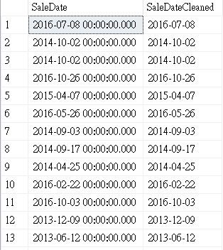

First of all, the original SaleDate format is YYYY-MM-DD HH-MM-SS, which it is not very relevant, I am going to change it to YYYY-MM-DD.

I first by adding a new column called SaleDateCleanned to the table and set it by converting the SaleDate into Date formate by using the **CONVERT()** function, after that I deleted the old column.

 

## Filling up Missing Value- Property Address

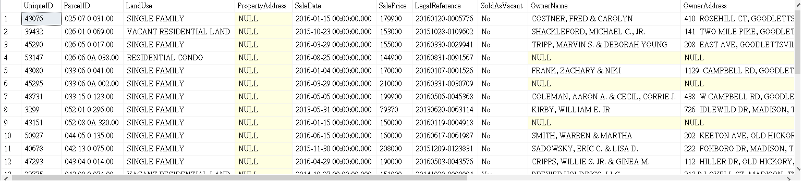

By checking the missing value on PropertyAddress, there are a 29 NULL values but the rest of the column has included valuable information. The goal here is to find a way to fill them up. 

 

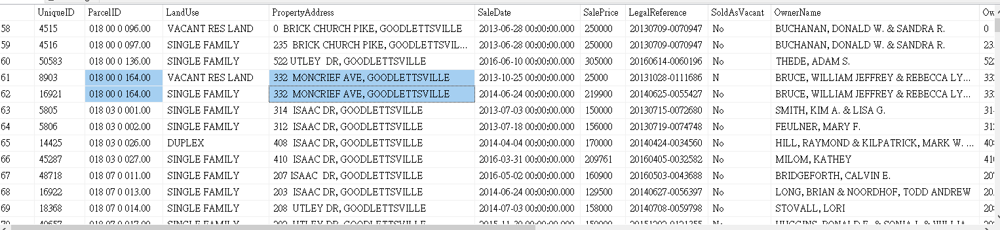

By ordering the ParcelID, We can see that the parcelID and Property Address are the same, which means we can fill up the correct property Address by referring to the correspondent ParcelID.

 

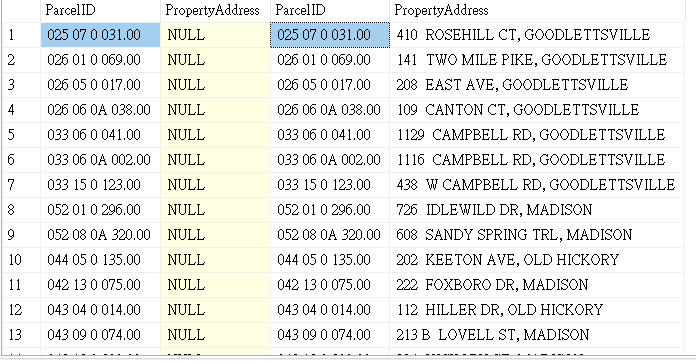

I have used **SELF JOIN** to check if table one ParcelID equals to table two ParcelID and table one UniqueID not equal to table two UniqueID. The outcome shows that the NULL PropertyAdress in table one can now be filled up with the correct address by referrring the corresponding ParcelID. By using the **ISNULL()** function, I can now replace and update the NULL value with the correct address.

 

## Separating a string column into differnt columns - Property Address

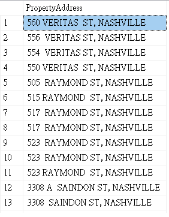

By looking at the Property Address column, we can see that there is only one delimiter separating the street and city. The goal here is to separate them into two columns.

 

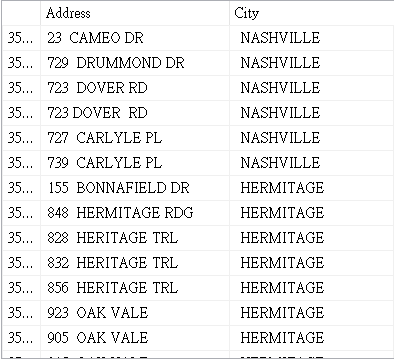

I have Used the **SUBSTRING** function and SQL Server **CHARINDEX()** function to first by finding out the delimiter position value and substringed them by that value. I then added the two new columns named as PropertyAddressCleanned and PropertyCityCleanned by updating the table. 

 

## Handling Binary Value - SoldAsVacant

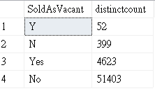

Under SoldAsVacant, the value should only be **Yes** or **No**. By using **DISTINCT**, **COUNT** and **GROUP BY** function, we can see that there are 4 different inputs as YES, NO, Y, N. The goal here is to combine them into either yes or no. 

 

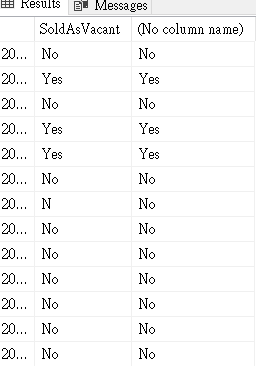

I have used a **CASE** statment to control the change, **WHEN** SoldAsVacant is'Y'/'N' **THEN** 'Yes'/'No', **ELSE** would reamins SoldAsVacant. After that, I updated the table. 

 

## Remove Duplicates

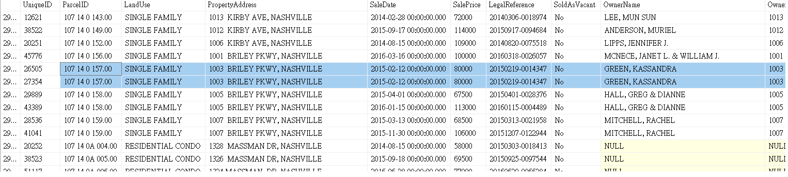

To define a duplicate entry in this dataset, it would means that the row would have the same column value but with a different UniqueID. Therefore, I am going to take the key columns(ParcelID, PropertyAddress, SalePrice, SaleDate, LegalReference) as an indicator. 

To do this, I first used the **ROW_NUMBER** funtion to give each row a count number and followed with the **PARTITION BY** function to partition out the columns that should be unique. From the diagram above, I have found a duplicate which the row count of 2. 

 

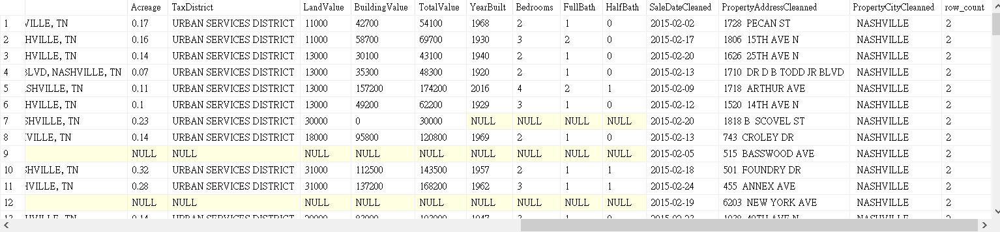

After that, I created a **CTE** table named as tempCTE which included the query from the above task, and run a **SELECT** statment **FROM** the tempCTE **WHERE row_count > 2** in order to filter out all the duplicate rows. Once we filtered them out, I used **DELETE** function to remove all those duplicates. 

 

## Deleting Unused Columns

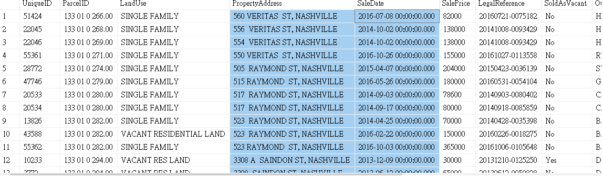

By recalling the tasks I have done above, I have created few new columns named with the name Cleanned, so now I have to delete those old columns which I don't need them anymore. 

A small note is do not do this to the raw data without any confirmation from the stakeholder.  

 

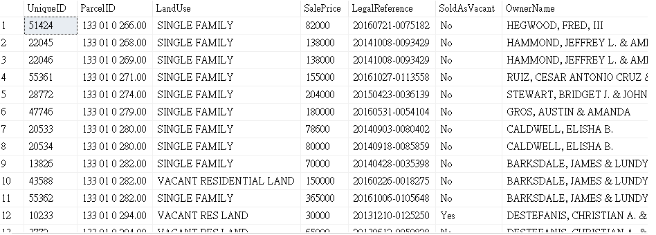

I have used **ALTER TABLE** and **DROP COLUMN** function to remove those old columns. 

